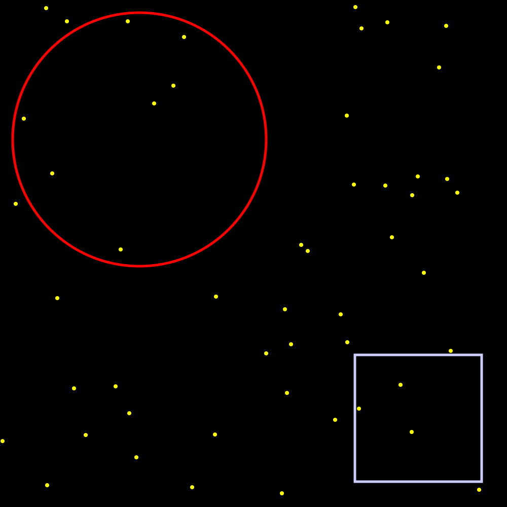

# Montecarlo
Basic Montecarlo distribution simulator to determine volume difference between a circle of radius `r` and a rectangle of a side length `r` based on a sample of randomly placed points in a plane. Requirements include `pycairo` for graphic output.

Output preview: 
- In plane: 40
- In circle: 7
- In rectangle: 3

